# BotFarmer-1point3acres

BotFarmer 是一亩三分地论坛每日签到、答题赚取积分的自动脚本。项目分为本地命令行交互、AWS 云端部署两个版本。

**本项目仅用于学习交流，如有侵犯论坛利益，请联系我删除仓库！**

## 环境要求

* 开发环境：macOS Catalina 10.15.5
* 测试环境：macOS Catalina 10.15.5
* Python 版本：3.7.6
* Python 依赖库：requests, Pillow, pytesseract, boto3
* 软件依赖：tesseract-ocr 4.0.0+, docker


## 使用说明

分别介绍本地命令行版本环境的安装、脚本运行，AWS 云端部署版的搭建，以及tesseract模型的训练。

### 本地命令行交互版

#### 安装 tesseract

一亩三分地论坛在2020年5月底的更新后，每日签到、答题都需要输入验证码，因此我使用 tesseract OCR 识别验证码。接下来介绍 tesseract 的安装和模型导入。

对于 macOS 平台用户，在 `terminal（终端）`应用中输入以下命令，即可安装软件：

```console
$ brew install tesseract
```

接下来查看 tesseract 安装位置，命令及可能的运行结果如下：

```console
$ brew list tesseract

/usr/local/Cellar/tesseract/4.1.1/bin/tesseract
/usr/local/Cellar/tesseract/4.1.1/include/tesseract/ (19 files)
/usr/local/Cellar/tesseract/4.1.1/lib/libtesseract.4.dylib
/usr/local/Cellar/tesseract/4.1.1/lib/pkgconfig/tesseract.pc
/usr/local/Cellar/tesseract/4.1.1/lib/ (2 other files)
/usr/local/Cellar/tesseract/4.1.1/share/tessdata/ (35 files)
```

其中 `/usr/local/Cellar/tesseract/4.1.1/share/tessdata/` 目录中保存了 tesseract 的 OCR 模型，我们将自己训练的模型也放在这个目录下。 在本项目目录 `train-tesseract/` 中的 `verify-codes.traineddata` 文件即为针对一亩三分地验证码所训练的模型。

*进入项目目录 `train-tesseract/`*，运行以下命令导入模型（请根据刚才的输出更改后边目录地址）：

```console
$ cp verify-codes.traineddata /usr/local/Cellar/tesseract/4.1.1/share/tessdata/
```

对于 Windows 平台用户，请访问 [https://digi.bib.uni-mannheim.de/tesseract/](https://digi.bib.uni-mannheim.de/tesseract/ "Tesseract Versions") 下载 tesseract 4.0.0 之后版本的安装包，运行安装包，根据提示将软件安装在本地。

在安装目录（默认为 `C:\Program Files (x86)\Tesseract-OCR`）中找到 `tessdata` 文件夹，将本项目目录 `train-tesseract/` 中的 `verify-codes.traineddata` 文件复制到该文件夹中，完成模型的导入。

#### 安装 Python 依赖库

本项目提供了 `pipenv` 的环境配置文件，打开命令行工具，*进入项目目录 `bot-farmer-local/`*，运行以下命令安装 Python 虚拟环境：

```console
$ pipenv install
```

如果不想创建 Python 虚拟环境，也可以运行以下命令直接安装 Python 依赖库：

```console
$ pip3 install requests Pillow pytesseract
```

#### 修改配置文件

首先我们通过抓包获取一亩三分地前端加密后的登陆密码。用浏览器访问一亩三分地论坛主页 [https://www.1point3acres.com/bbs/](https://www.1point3acres.com/bbs/ "一亩三分地")，退出登录后打开浏览器的网页检查器，选择 `Network（网络）`选项卡，勾选 `Preserve log（保留日志）`选项，保持`录制`为打开状态，如图：

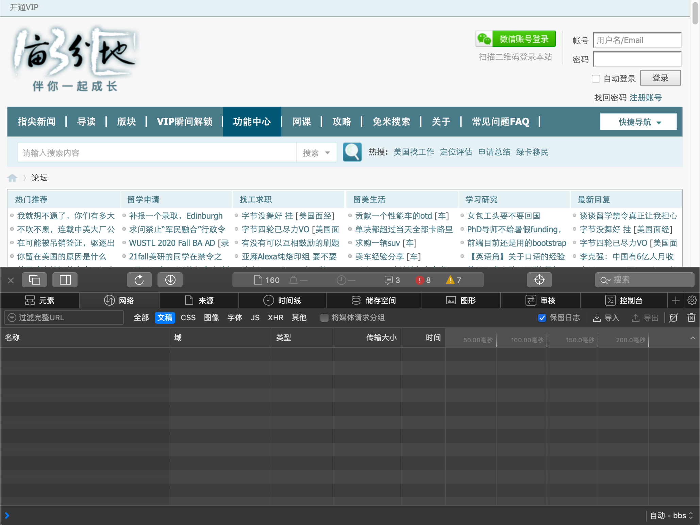

输入用户名和密码，点击登录，这时会录制到对网页的请求，在网页检查器中选择查看 `Doc （文稿）`，找到名称为 `member.php` 的 POST 方法记录，查看它的 `Header （标头）`，滚动到最下边就可以在请求数据中找到网页前端加密后的密码，如图：

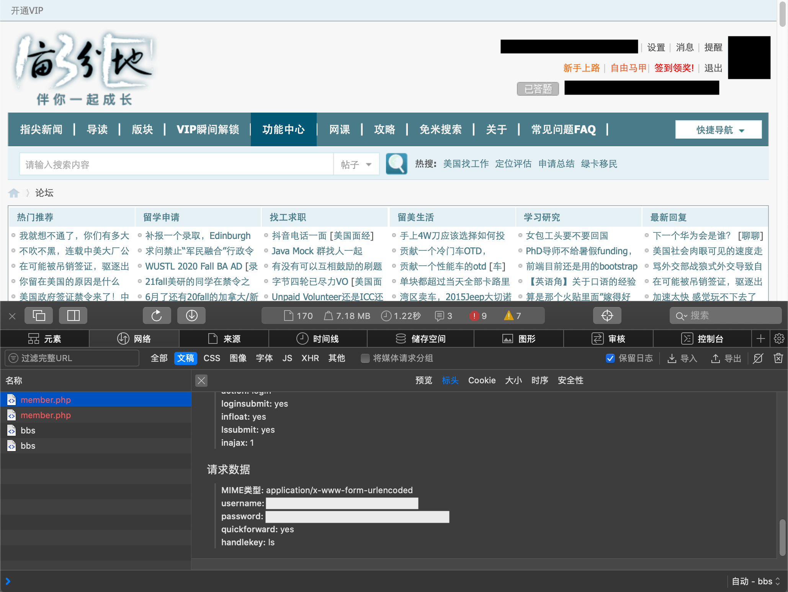

在项目目录 `bot-farmer-local/` 中找到 `user.json` 文件，修改文件内容：

```json
{
    "uid": "填写请求数据中username后的值",
    "passwd": "填写请求数据中password后的值"
}
```

#### 运行脚本

打开命令行工具，*进入项目目录 `bot-farmer-local/`*。如果之前安装了 Python 虚拟环境，执行以下命令将其打开：

```console
$ pipenv shell
```

执行以下命令运行脚本进行论坛每日签到、答题：

```console
$ python automatic.py
```

也可以用传递参数的形式单独进行签到、答题操作。

用如下命令进行签到操作：

```console
$ python automatic.py check_in
```

脚本会随机选择一个心情，“今天最想说”中填写某字典每日一句，并自动识别验证码并检查验证码正确性。

用如下命令进行答题操作：

```console
$ python automatic.py take_quiz
```

脚本会获取用户今天的题目和对应的4个选项，并在项目目录 `bot-farmer-local/` 里的 `cheat_sheet.json` 中寻找该题目和正确答案。如果该文件能够提供唯一的答案，脚本会自动作出选择；如果找不到该题目，或者出现未知错误不能提供唯一答案，则会以命令行交互的方式向用户询问答案。之后脚本会自动识别验证码并检查验证码的正确性。在自动提交题目后，脚本会根据一亩三分地论坛的反馈信息判断作答的正确性，并据此更新 `cheat_sheet.json` 文件，将错误的答案删除，保留或添加正确的答案。

如果使用 Python 虚拟环境运行的脚本，关闭命令行工具窗口或执行以下命令退出虚拟环境：

```console
$ exit
```
-----

### AWS 云端部署版

部署在云端上的版本不仅可以实现定时自动触发签到、答题，也支持同时处理多个一亩三分地论坛账号。其结构如图所示：

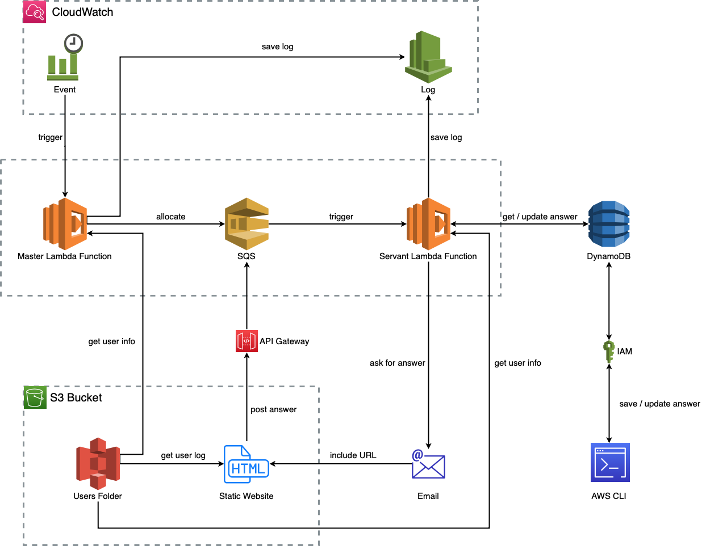

`CloudWatch` 中的事件定时触发 `Master Lambda Function（包工头）`读取 `S3` 桶中的所有论坛账号信息，将签到、答题任务通过 `SQS` 分配给多个 `Servant Lambda Function（BotFarmer）`去完成。`DynamoDB` 表格中存储 cheat sheet，`Servant Lambda` 在答题时从中获取、更新答案，也可以通过脚本同步本地 `cheat_sheet.json` 与云端的表格中的数据。由于云端与用户和开发者之间的交互不是以命令行输入、输出进行的，所以用户提供答案的方式变为收取带有提供答案网页 URL 的邮件，该 URL 由 `S3` 静态部署的网页地址和该用户账户、日志时间戳参数组合而成，网页通过 URL 中的参数在 `S3` 中提取用户和日志信息，生成表单。用户提交的答案会经过 `API Gateway` 转换为触发数据再次触发 `Servant Lambda` 进行答题操作。由于 `S3` 中文件不方便查看，所以运行的日志也会发送回 `CloudWatch` 中方便阅读。

接下来介绍实际部署过程。

#### DynamoDB

使用本地脚本控制 DynamoDB 表格的前提是提供访问、操作权限，因此登录 AWS 后，在服务中搜索 `IAM`。在`访问管理`中选择`用户`，再点击`添加用户`，你会看到如下页面，输入任意用户名，并勾选`编程访问`：

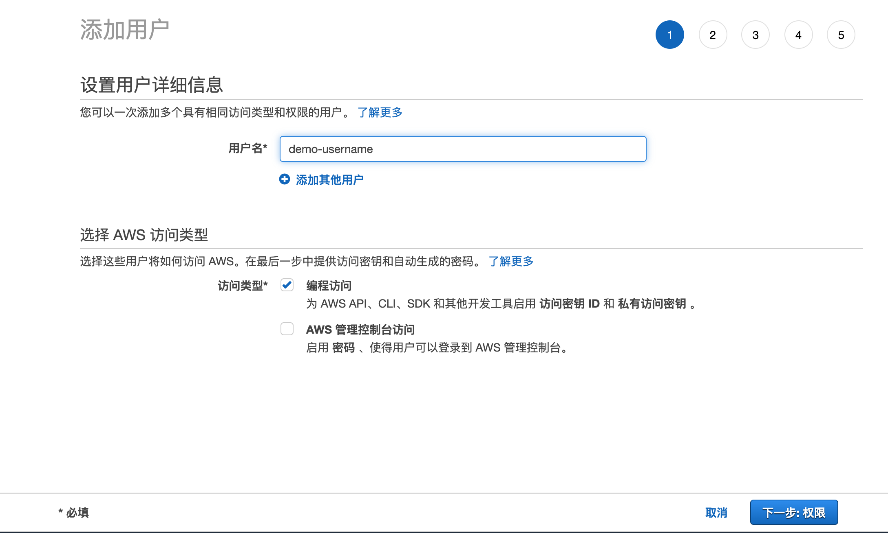

点击`下一步：权限`进入步骤2页面，选择`直接附加现有策略`，并在`策略筛选`中搜索 `DynamoDB`，并勾选 `AmazonDynamoDBFullAcess`，给该用户访问、修改表格的权限。

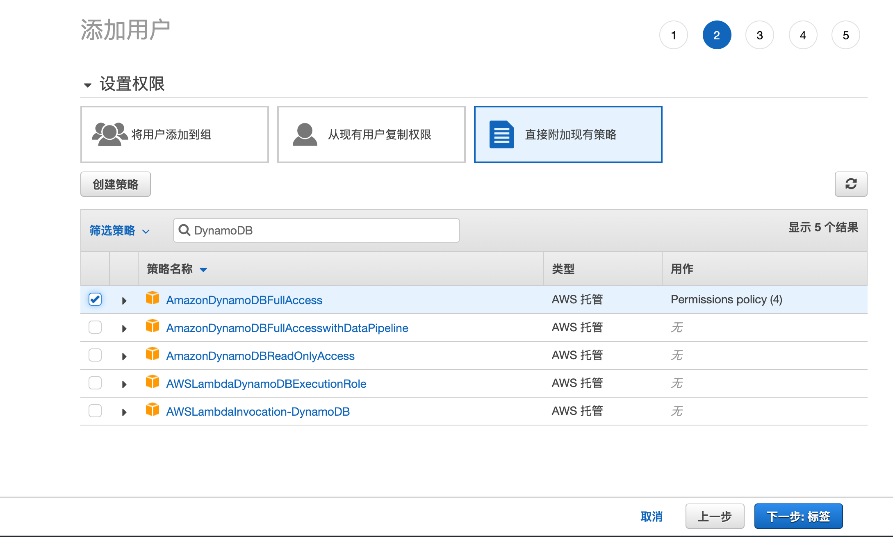

点击`下一步`，跳过步骤3和步骤4，进而看到添加用户成功的页面，将这个页面中提供的`访问密钥 ID` 和`私有访问密钥`记录下来。

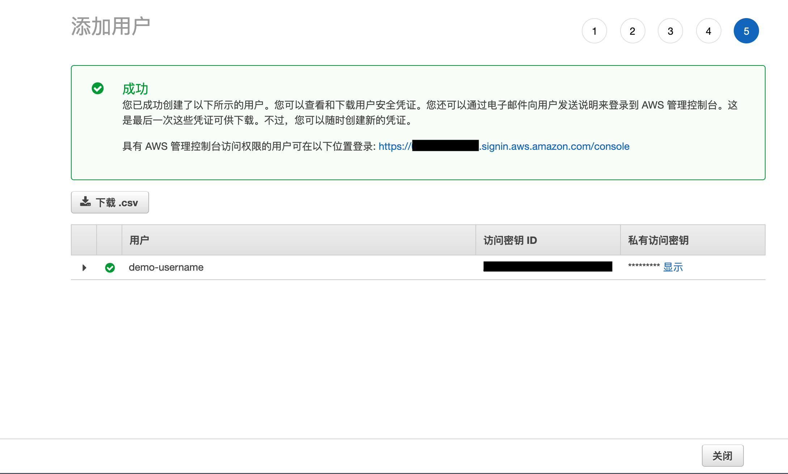

进入项目目录 `bot-farmer-AWS/DynamoDB/` 中，找到 `aws-profile.json` 文件，修改其内容：

```json
{
    "IAM access key": "记录下来的访问密钥 ID",
    "IAM secret key": "记录下来的私有访问密钥",
    "region": "你希望表格存储的区域，如：us-west-1",
    "table": "创建出来表格的名字，避免与账户中所选区域内的表格重名，会造成数据丢失"
}
```

本项目提供了 `pipenv` 的环境配置文件，打开命令行工具，*进入项目目录 `bot-farmer-AWS/DynamoDB/`*，运行以下命令安装 Python 虚拟环境：

```console
$ pipenv install
```

如果不想创建 Python 虚拟环境，也可以运行以下命令直接安装 Python 依赖库：

```console
$ pip3 install boto3
```

打开命令行工具，*进入项目目录 `bot-farmer-AWS/DynamoDB/`*。如果之前安装了 Python 虚拟环境，执行以下命令将其打开：

```console
$ pipenv shell
```

目录中的 `table_data.py` 脚本必须传递正确的参数才可以运行，其支持三种操作：

1. `upload`：将目录里 `cheat_sheet.json` 文件中的数据上传到云端表格中，如果表格不存在则自动创建空表。执行命令如下：

    ```console
    $ python table_data.py upload
    ```

    将 `cheat_sheet.json` 文件数据（可能为空）上传到非空的云端表格中这个操作存在数据冲突、丢失等风险，因此会被脚本拒绝，如果执意做此操作，需要在命令后附加参数 `-f`。

2. `download`：将云端表格中的数据下载至目录里 `cheat_sheet.json` 文件中，如果文件不存在则自动创建空文件。执行命令如下：

    ```console
    $ python table_data.py download
    ```

    将云端表格中数据（可能为空）下载至非空的 `cheat_sheet.json` 文件中这个操作存在数据冲突、丢失等风险，因此会被脚本拒绝，如果执意做此操作，需要在命令后附加参数 `-f`。

3. `merge`：将目录里 `cheat_sheet.json` 文件中的数据与云端表格中的数据合并，并同步更新文件和表格。执行命令如下：

    ```console
    $ python table_data.py merge
    ```

    不管 `cheat_sheet.json` 文件中和云端表格中是否有数据，该操作都不会造成数据冲突、丢失，因此无需在命令后附加参数 `-f`，即使加上也会被脚本忽略。

如果使用 Python 虚拟环境运行的脚本，关闭命令行工具窗口或执行以下命令退出虚拟环境：

```console
$ exit
```
-----

#### SQS

本项目使用 AWS SQS 实现任务的分配和多个账户的同时签到、答题。这里创建一个新的 SQS 队列。

登录 AWS 后，在服务中搜索 `SQS`。点击`新建队列`，填写队列名称，确定区域是否为常用区域，选择`标准队列`（因为用于任务分配），完成后，点击下方`快速创建队列`。

回到 SQS 的初始页面，选中刚创建的队列，记录`详细信息`选项卡中的`URL`、`ARN` 信息。

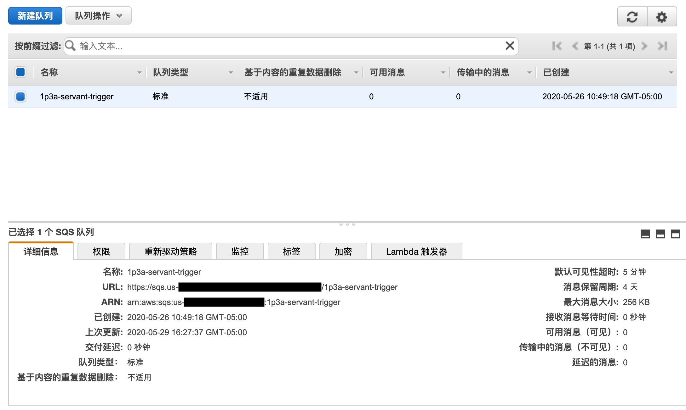

-----

#### API Gateway

前边提到，在与用户交互询问每日答题答案时，需要用户在一个 S3 部署的静态网页中选择答案，在将其重提交给 SQS 去分配答题任务给 `Servant`。但是 S3 只用于存储和静态网页部署，无法运行 Node.js 对 SQS 直接进行操作，因此需要给前端 js 提供一个传递信息给 SQS 的接口。

先为接口创建角色。所谓角色，用来给 AWS 产品对象相应操作的权限（策略）。在对象间相互操作时，要分配发起对象去操作被操作对象的权限，这就是发起对象的角色。

登录 AWS 后，在服务中搜索 `IAM`。在`访问管理`中选择`策略`，再点击`创建策略`。选择 `JSON` 选项卡，并将以下内容复制进入输入框，*注意修改 "Resource" 后内容*：

```json
{
    "Version": "2012-10-17",
    "Statement": [
        {
            "Sid": "VisualEditor0",
            "Effect": "Allow",
            "Action": "sqs:SendMessage",
            "Resource": "上一部分刚记录的 SQS 队列的 ARN 信息"
        }
    ]
}
```

点击下方`查看策略`，填写策略名称，习惯以 `policy` 结尾，但不是必须。再点击下方`创建策略`。

回到 `IAM` 初始页面，在`访问管理`中选择`角色`，再点击`创建角色`，你会看到如下页面。选择 `AWS 产品`，再选择 `API Gateway`，点击下方`下一步：权限`：

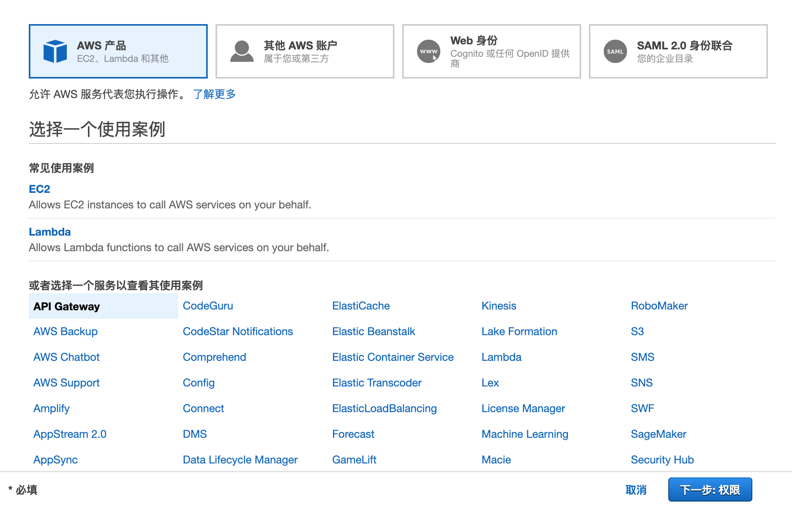

再点击下方`下一步`，跳过步骤2和步骤3，来到步骤4，给角色起一个名称，习惯以 `role` 结尾，但不是必须。检查`策略`应该只有 `AmazonAPIGatewayPushToCloudWatchLogs` 一项，确认无误后，点击下方`创建角色`：

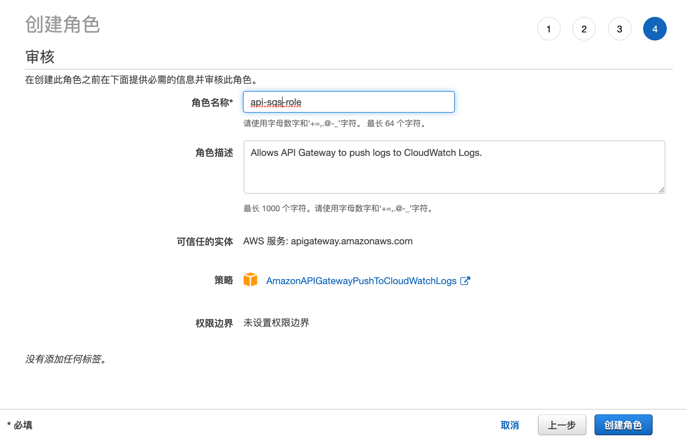

创建好后，点击进入新建的角色。在`权限`选项卡中，点击`附加策略`，并选择上一步刚创建的策略。关闭页面前顺便记录该角色的 ARN 信息。

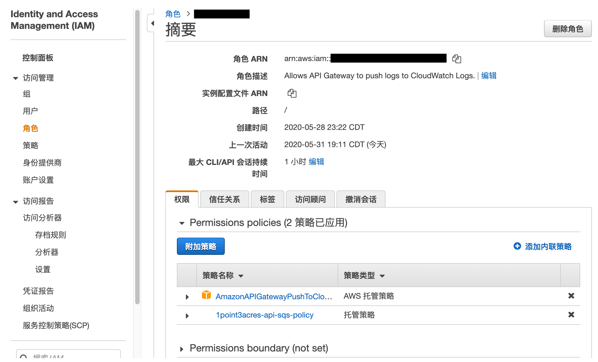

有了角色后就可以创建 API Gateway 了。登录 AWS 后，在服务中搜索 `API Gateway`，点击`创建 API`，找到 `REST API`, 点击`构建`。给 API 任意起个名字，点击`创建 API`。

进入刚创建的 API，确保在`资源`页面，点击上方的`操作`按钮，在下拉菜单中选择`创建资源`，任意填写资源名称，点击`创建资源`。选中刚创建的资源，点击上方的`操作`按钮，在下拉菜单中选择`创建方法`，并选则 `POST` 方法。

在右侧的设置中，按照以下方式选择填写信息：

* `集成类型`选择 `AWS 服务`
* `AWS 区域`选择刚创建的 SQS 队列所在区域
* `AWS 服务`选择 `Simple Queue Service (SQS)`
* `HTTP 方法`选择 `POST`
* `操作类型`选择`使用路径覆盖`
* `路径覆盖（可选）`中填写刚才记录的 SQS URL 信息的后半部分内容，即 `AWS 账号 ID / SQS 名称`
* `执行角色` 中填写刚记录的 API 角色的 ARN 信息

填写完后内容大致如图：

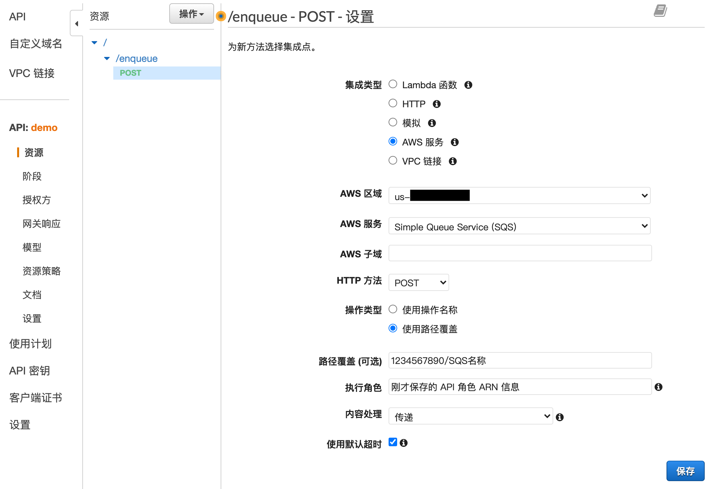

点击下方`保存`后，看到如下页面：

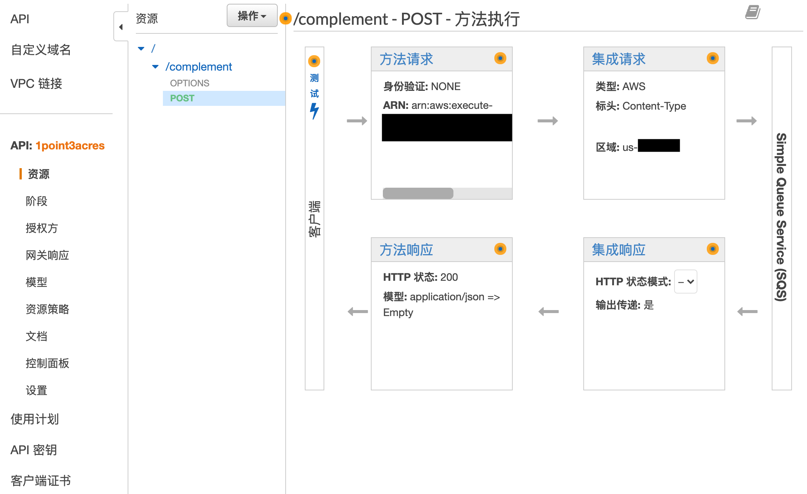

选则`集成请求`，进去后向下滚动，在`HTTP 标头`表格中添加信息，*注意复制完全，要有单引号*：

|名称         |映射自                              |
|:-----------|:----------------------------------|
|Content-Type|'application/x-www-form-urlencoded'|

打开最下方`映射模板`折叠菜单，`请求正文传递`选择`从不`选项，在点击`添加映射模板`，在里边填写 `application/json`，再在下方输入框中输入以下内容，并点击`保存`：

```
Action=SendMessage&MessageBody=$input.json('$')
```

填写完成后的页面如图所示：

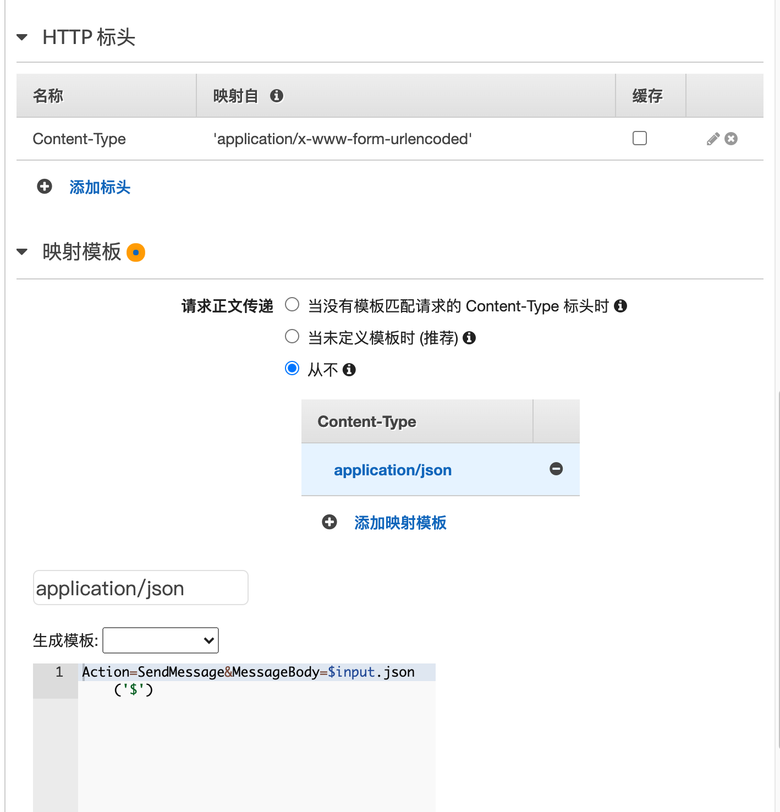

选中左手的绿色`POST`方法，点击上方的`操作`按钮，在下拉菜单中选择`启用 CORS`，并点击`启用 CORS，并替换现有 CORS 标头`。

再次选中左手的绿色`POST`方法，点击上方的`操作`按钮，在下拉菜单中选择`部署 API`，任意填写部署阶段名称，并点击`部署`。在左侧找到`阶段`，选择刚才创建的部署，取消折叠，在里边找到 POST 方法，页面如下，记录其中的`调用 URL`。

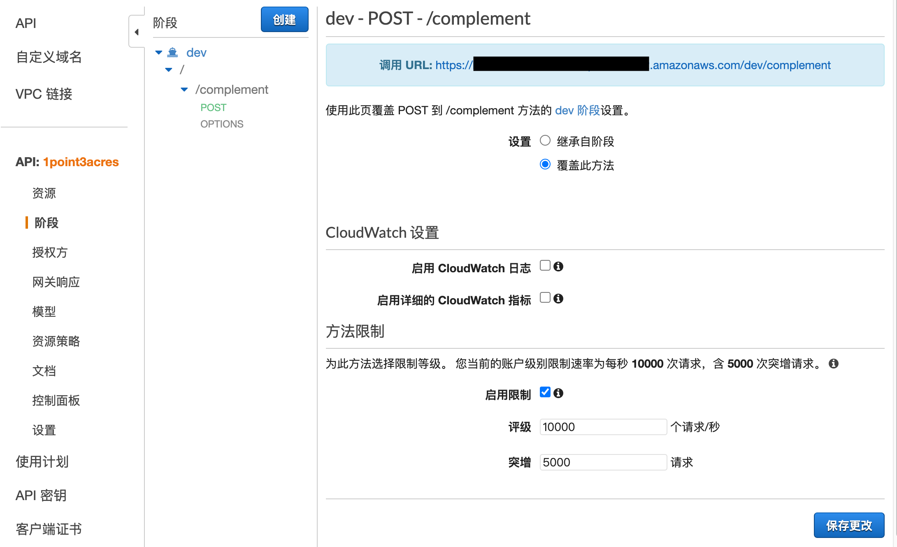

-----

#### S3

S3 桶中存储静态网页文件和用户信息。现将静态网页连接上刚创建的 API 接口。进入项目目录 `bot-farmer-AWS/S3/js/`，打开 `index.js` 文件，找到并修改这句（默认为第4行）：

```javascript
// Config of this web page
const SQS_API_URL = 'API Gateway 部署后提供的 POST 方法的调用 URL';
```

再添加用户信息，进入项目目录 `bot-farmer-AWS/S3/users`，里边的 `user1/` 和 `user2/` 文件夹只是文件结构的示范，可以删除。在目录中新建和一亩三分地论坛登录账号（用户名或邮箱）同名的文件夹，进入该文件夹，新建 `user.json` 文件，并打开添加内容：

```json
{
    "uid": "一亩三分地论坛登录账号",
    "passwd": "与本地命令行版相同的加密密码",
    "check in": true,
    "take quiz": true
}
```

其中 `"check in"` 和 `"take quiz"` 如果值填写 `true`， 则脚本会为该账户进行相应操作，反之填写 `false`，则对该账户忽略相应操作。可以在项目目录 `bot-farmer-AWS/S3/users` 中新建多个文件夹，为多个一亩三分地论坛账户进行每日签到、答题操作。

然后我们回到 AWS 云端创建 S3 存储桶。登录 AWS 后，在服务中搜索 `S3`。在`存储桶`中点击`创建存储桶`。在常规设置中，任意填写存储桶名称，选择常用的区域。在`存储桶的“阻止公开访问”设置`中，取消勾选`阻止所有公有访问权限`，并勾选下方的`我了解，当前设置可能会导致此存储桶及其中的对象被公开`，*这是偷懒行为，会将存储桶完全公开*。点击最下方的`创建存储桶`。

进入创建的存储桶中，选择`权限`选项卡，在`阻止公共访问权限`一栏中，再次确认所有组织内容被全部关闭。再进入存储桶策略一栏，将以下代码复制到文本框内，*注意更改 "Resource" 信息*：

```json
{
    "Version": "2012-10-17",
    "Statement": [
        {
            "Effect": "Allow",
            "Principal": "*",
            "Action": "s3:GetObject",
            "Resource": "arn:aws:s3:::本存储桶名称/*"
        }
    ]
}
```

选择`属性`选项卡，找到`静态网页托管`卡片，如下图，选择`使用此存储桶托管网站`，并填写`索引文档`为 `index.html`。记录`终端节点`后的 URL。点击`保存`。

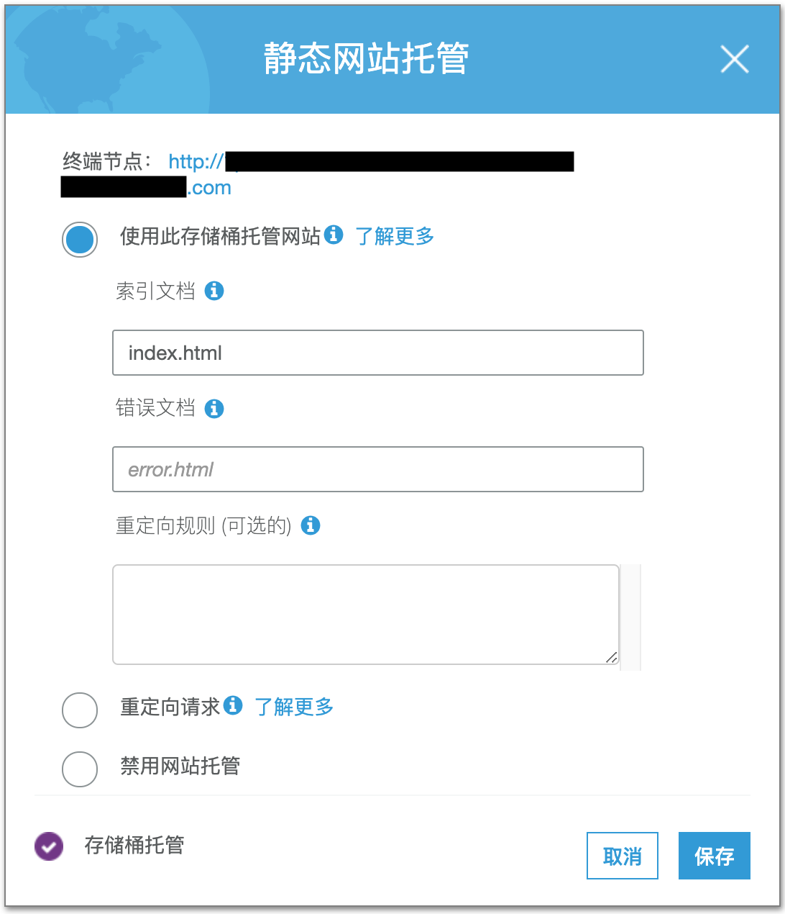

-----

#### Lambda Function

如之前所说，项目中有两个 Lambda Function， `Master（包工头）`将签到、答题任务通过 SQS 分配给多个 `Servant（BotFarmer）`去完成。

##### Master Lambda Function

先为 `Master` 创建 `role（角色）`。登录 AWS 后，在服务中搜索 `IAM`。在`访问管理`中选择`角色`，再点击`创建角色`，你会看到如下页面。选择 `AWS 产品`，再选择 `Lambda`，点击下方`下一步：权限`：

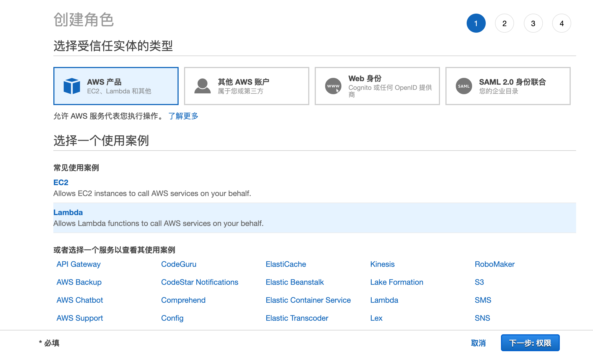

由于 `Master` 的工作是读取 S3 桶中存储的用户信息，并将所有用户的信息发送给 SQS 去分配任务给 `Servant`，再把工作的日志发送给 CloudWatch，所以在步骤2中，图省事直接在筛选策略中输入 `S3`，在下方勾选 `AmazonS3FullAccess`；在筛选策略中输入 `SQS`，在下方勾选 `AmazonSQSFullAccess`；再在筛选策略中输入 `CloudWatchLogs`，在下方勾选 `CloudWatchLogsFullAccess`。*其实应该按需求给予有限的权限，这里都给 FullAccess 是真的不动脑子偷懒了。*

点击下方`下一步：标签`，再点`下一步`跳过步骤3。来到步骤4，给角色起一个名称，检查`策略`中三个之前选择的策略是否齐全，确认无误后，点击下方`创建角色`：

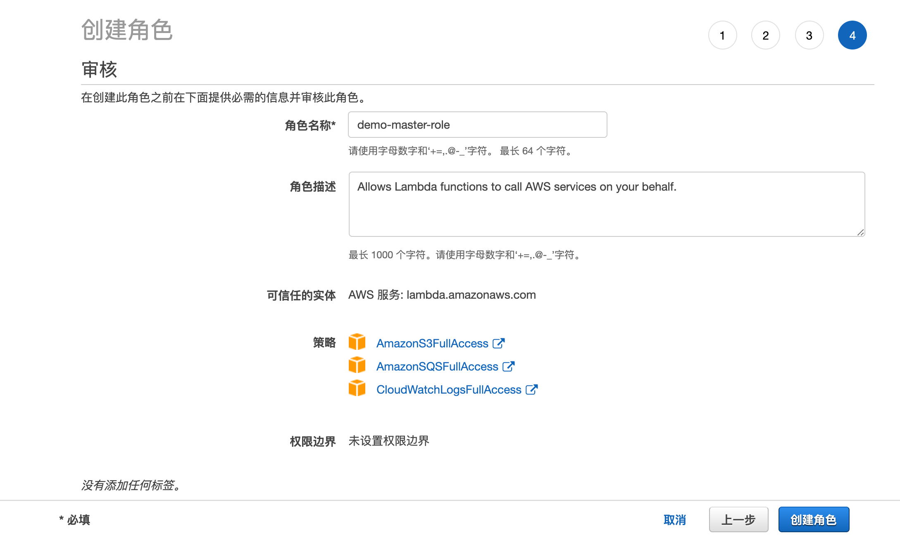

在 AWS 服务中搜索 `Lambda` 默认进入`函数`页面。点击`创建函数`，选择`从头开始创作`，填写任意函数名，选择`运行时`为 `Python 3.7`。取消下方折叠的`选择或创建执行角色`菜单，选择`使用现有角色`，在`现有角色`中选择上一部分刚创建出来的角色。最后点击下方`创建函数`。

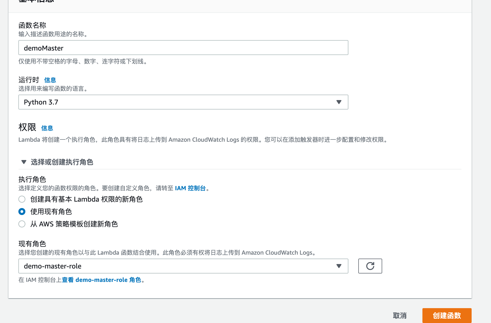

由于本 Lambda 函数处理任务受用户数量影响，所以默认的函数执行性能和成本限制可能会导致函数在运行结束前就被强行终止，因此我们要修改默认的函数执行性能。*本操作会使函数的成本增加，心疼小钱钱的话要再三考虑。*进入刚创建的函数，向下滚动页面，找到`基本设置`，点击`编辑`进入。可以看到默认的运行时间限制是3秒钟，搁谁都得觉得这比公兔还快… 

所以按照自己的需求调整`内存`和`超时`，调整好后，点击下方`保存`。

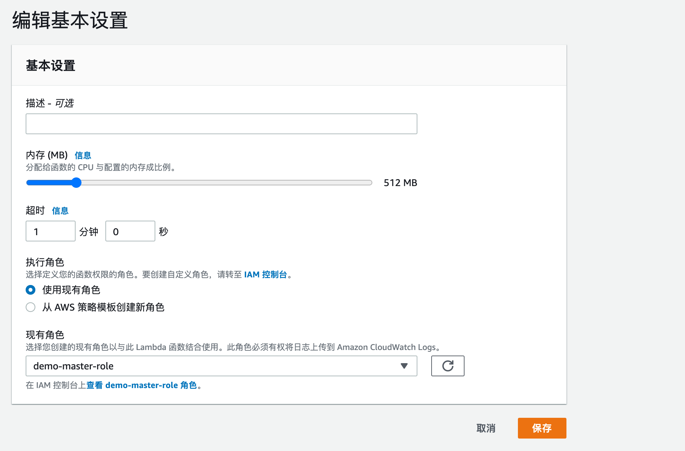

回到本地项目目录 `bot-farmer-AWS/Lambda/master/`，找到 `config.json` 文件，打开编辑：

```json
{
    "Bucket": "刚创建的 S3 存储桶的名称",
    "SQS URL": "SQS 队列的 URL 信息",
    "Preserve Days": "即 S3 存储桶中保存日志的时间，默认为7，即保存7天"
}
```

将本地项目目录 `bot-farmer-AWS/Lambda/master/` 中的所有文件打包为一个 `.zip` 压缩文件。回到 AWS 云端，在 `Master` 函数代码中找到选项`代码输入种类`，并选择`上传 .zip 文件`，将刚打包的压缩文件上传。*最后等文件上传后，别忘记点击右上角的`保存`*。

-----

##### Servant Lambda Function

先为 `Servant` 创建 `role（角色）`。与为 `Master` 创建角色相同，登录 AWS 后，在服务中搜索 `IAM`。在`访问管理`中选择`角色`，再点击`创建角色`。选择 `AWS 产品`，再选择 `Lambda`，点击下方`下一步：权限`。

由于 `Servant` 的工作是通过 SQS 发送的信息触发任务，读取 S3 存储桶中用户的信息，为用户签到，再从 DynamoDB 中找到每日答题的答案，进而帮助用户完成答题，之后把工作的日志发送给 CloudWatch，所以再步骤2中，再次偷懒勾选以下策略：

* `AmazonSQSFullAccess`
* `AmazonS3FullAccess`
* `AmazonDynamoDBFullAccess`
* `CloudWatchLogsFullAccess`

点击下方`下一步：标签`，再点`下一步`跳过步骤3。来到步骤4，给角色起一个名称，检查`策略`中4个之前选择的策略是否齐全，确认无误后，点击下方`创建角色`。

以相同于创建 `Master` 函数的方法创建 `Servant` 函数，依然选择`运行时`为 `Python 3.7`，角色是指为刚创建的 `Servant` 的角色。

由于本 `Servant` 函数处理任务受数据库是否提供答案、验证码识别是否正确等不确定因素的影响，所以默认的函数执行性能和成本限制可能会导致函数在运行结束前就被强行终止，因此我们要修改默认的函数执行性能。*本操作会使函数的成本增加，心疼小钱钱的话要再三考虑。*进入刚创建的函数，向下滚动页面，找到`基本设置`，点击`编辑`进入。按照自己的需求调整`内存`和`超时`，调整好后，点击下方`保存`。

回到本地项目目录 `bot-farmer-AWS/Lambda/servant`，找到 `config.json` 文件，打开修改：

```json
{
    "S3_USERS_BUCKET": "S3 存储桶的名称",
    "DYNAMODB_TABLE": "DynamoDB 中 cheat sheet 表格的名称",
    "STATIC_WEBSITE": "S3 静态托管的网页终端节点 URL",
    "GMAIL_ACCOUNT": "给用户发邮件的邮箱，由于用 Gmail 服务器，所以要提供 Gmail 邮箱",
    "GMAIL_PASSWORD": "Gmail 邮箱的登录密码"
}
```

将本地项目目录 `bot-farmer-AWS/Lambda/servant/` 中的所有文件打包为一个 `.zip` 压缩文件。回到 AWS 云端，在 `Servant` 函数代码中找到选项`代码输入种类`，并选择`上传 .zip 文件`，将刚打包的压缩文件上传。*最后等文件上传后，别忘记点击右上角的`保存`*。

在 AWS 云端 `Servant` 函数页面内，找到 `Designer` 模块，点击里边的 `添加触发器`，这里我们要将 SQS 作为 `Servant` 的触发器，所以选择 `SQS`，输入 SQS 队列的 ARN 信息，*批处理大小设置为1*，*批处理大小设置为1*，*批处理大小设置为1*，点击下方`添加`。

这时函数还是不能运行，原因是缺少所谓的 Python 依赖库和 tesseract 软件依赖环境，这时我们要通过创建 Lambda `layer（层）`给函数提供运行环境。

回到本地项目目录 `bot-farmer-AWS/Lambda/generate-layers/` 中，如果图省事可以使用 `layers/` 文件夹中我已经打包好的 `.zip` 压缩包。

在 AWS 服务中搜索 `Lambda`，在左手边选择 `层`，点击`创建层`。 你会看到下图页面。名称任意起，习惯以依赖库的名称命名；选择`上传 .zip 文件`，并将项目目录 `bot-farmer-AWS/Lambda/generate-layers/layers/` 中对应的依赖库 `.zip` 压缩包上传；`兼容运行时`只选择 `Python 3.7`；都填写完毕后，点击下方`创建`。

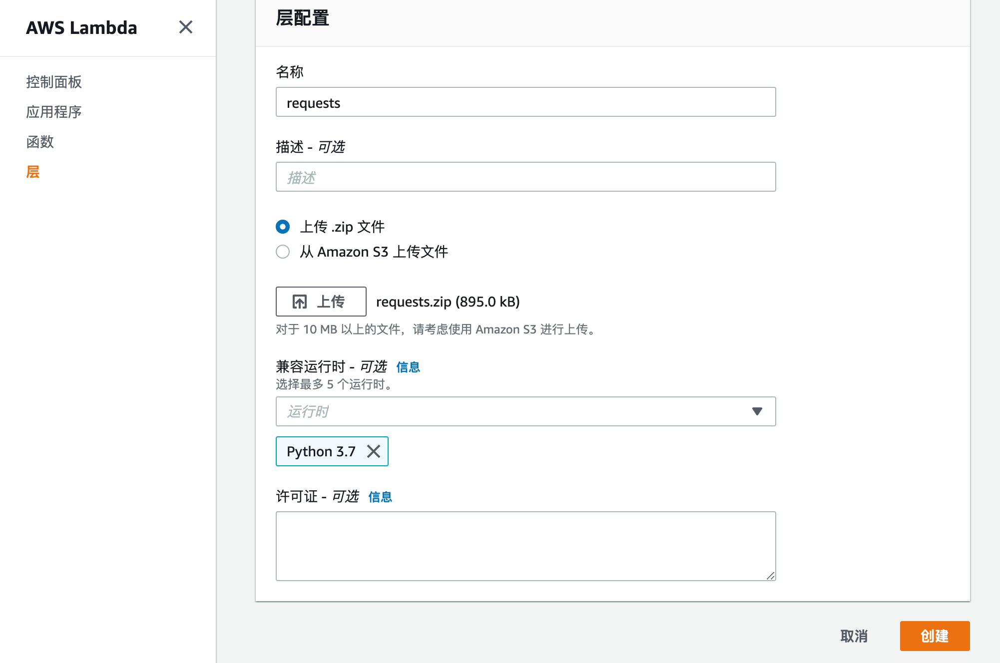

要注意的是一个层只能添加一个依赖库，所以你要分别为项目目录 `bot-farmer-AWS/Lambda/generate-layers/layers/` 中4个依赖库分别创建4个层。

回到 AWS 云端 `Servant` 函数页面内，依然是在 `Designer` 模块内，找到 `Layers`，点击`添加层`，选择刚创建的层，*也是一次只能添加一层*，点击`添加`，将其加入到 `Servant` 函数内，重复4次将所有层全部添加进去之后的效果如图所示：

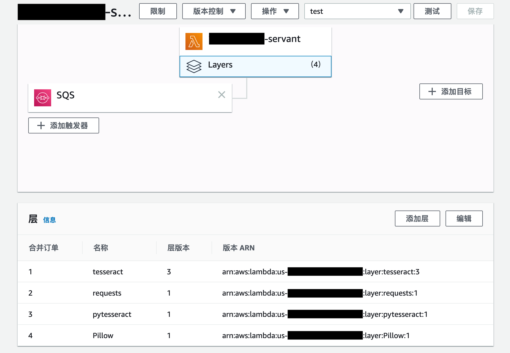

这时 `Servant` 函数还是不能运行，因为你还需要把层内依赖库的路径添加到函数的环境变量中。在 AWS 云端 `Servant` 函数页面内，向下滚动，找到`环境变量`，点击`编辑`，你会看到如下页面。在`键`中填写`PYTHONPATH`，再在`值`中填写 `/opt/`，填写完后点击下方`保存`。*对 Lambda 函数进行这些更改后不要忘记点击右上角的`保存`，应用所作出的修改！*

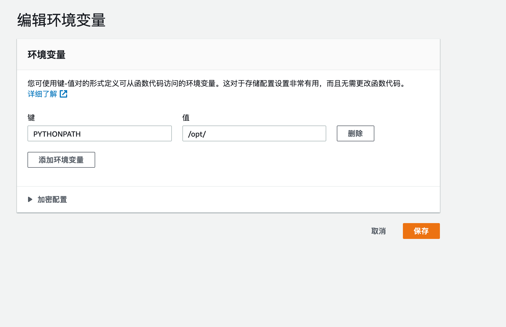

-----

#### CloudWatch

到这里 AWS 云端结构基本搭建完成，只差最后一环，即定时触发 `Master` 函数的 CloudWatch 事件规则。登录 AWS 后，在服务中搜索 `CloudWatch`。在左手`事件`一栏中找到`规则`。点击`创建规则`，选择`计划`，再选择 `Cron 表达式`，这里可以定义每日触发函数的 UTC 时间，需要注意的是：

* 一亩三分地论坛每日签到更新时间：北京时间0点，表达式为 `1 16 * * ? *`
* 一亩三分地论坛每日答题更新时间：UTC 时间0点，表达式为 `1 0 * * ? *`

表达式第一位代表 UTC 时间分钟，第二位代表 UTC 时间小时，因为是每日触发，所以其他位填写通配符。其实这里时间可以任意填写，由于我是压着一亩三分地论坛答题更新时间进行函数的触发，为了防止延迟不同步，所以我其实设置的是在整点过1分的时候触发函数。

在右边选择`添加目标`，选择 `Lambda 函数`，并选择 `Master` 函数名，选择完后点击`配置详细信息`。

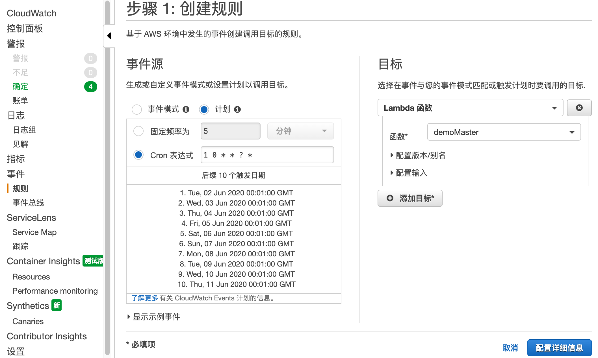

给规则命名后，点击`创建规则`。至此 BotFarmer AWS 云端部署版搭建完成。

-----

### 打包自己的层 .zip 文件

如果一亩三分地更新了验证码生成机制，或者你希望网用其他 Python 依赖库修改本项目，你就需要自己打包 Lambda Layers 所需要的 .zip 文件了。*以下打包操作需要你在本地安装 Docker！*

#### 制作 tesseract 层

命令行工具*进入本地项目目录 `bot-farmer-AWS/Lambda/generate-layers/tesseract-docker`*，将你自己训练的 `verify-codes.traineddata` 文件替换目录中原文件，在命令行工具中执行以下命令：

```console
$ bash build_tesseract4.sh
```

等待命令运行完成，在目录中就可以看到打包好的 `tesseract-layer.zip` 文件。

------

#### 制作 Python 依赖库层

命令行工具*进入本地项目目录 `bot-farmer-AWS/Lambda/generate-layers/packages-docker`*，修改目录中 `build_py37_pkgs.sh` 文件内容（默认在第4行），修改添加 Python 依赖库名字：

```sh
declare -a arr=("requests" "pytesseract" "Pillow")
```

之后在命令行工具中执行以下命令：

```console
$ bash build_py37_pkgs.sh
```

等待命令运行完成，在目录中就可以看到各个依赖库名称命名的多个 .zip 文件。

-----

### 训练自己的 tesseract-ocr 模型

#### 制作训练集

由于目前一亩三分地论坛的验证码是由英文字母和数字组成的，所以应当把从论坛上请求下来的验证码进行降噪处理，再进行分割，保证每张图片上只有一个字符。再新建多个文件夹，每个文件夹中只保存一种字符（区分大小写），文件夹的名字为其中保存的字符。如果是英文小写字母，因为有些文件系统（macOS）认为大小写重名，所以在小写英文字母后加上 `_` 下划线，以作区分。

完成上边的数据集 ground truth 标定操作后，将所有数据集文件夹打包为 `raw.zip` 压缩文件，放入项目目录 `train-tesseract/dataset/` 中，替换原有的 `raw.zip` 文件。再在命令行工具中执行以下命令，生成用于训练的 `ground-truth.zip` 训练集：

```console
$ python make_dataset.py
```

执行完命令后，项目目录 `train-tesseract/dataset/` 中原有的 `ground-truth.zip` 文件已被替换为最新的训练集文件，将这个文件拷贝到项目目录 `train-tesseract/train-docker/` 中，替换原有文件。

这里需要说明，通过观察我标定训练集，可以看出里边存在很多大小字体都一样的重复字符，我没有去除重复内容的原因是我希望训练出来的模型是过拟合模型，而不具有太强的泛化能力。原因是一亩三分地的验证码生成机制非常死板，我的模型只要能识别好地里生成的验证码就好，模型越是过拟合，识别效果反而会越好。

-----

#### 训练模型

*使用命令行工具中进入项目目录 `train-tesseract/train-docker/`*，执行以下命令，创建用于训练的 Docker 容器：

```console
$ docker-compose -f docker.dev.yml up
```

再使用命令行工具，执行以下命令进入创建好的 Docker 容器：

```console
$ docker exec -ti train-ocr bash
```

在 Docker 容器的 bash 中执行以下命令，训练自己的 tesseract-ocr 模型：

```console
$ make training MODEL_NAME=verify-codes START_MODEL=eng PSM=10 TESSDATA=/usr/local/share/tessdata
```

这里注意各个参数的含义：

* `MODEL_NAME`：训练后的模型名称，这个如果更改，项目中部分文件需要进行改动
* `START_MODEL`：用什么语言开始训练，默认是 `eng` 英语
* `PSM`：识别模式，默认为10，即识别单字符；常用的值还有7，即识别但行文字
* `TESSDATA`：Docker 容器中 `tessdata/` 目录所在路径，不应更改

命令执行完毕后即可在项目目录 `tain-tesseract/train-docker/src/tesstrain/data/` 中找到训练好的 `.traineddata` 文件。

如果对模型的名字进行了更该，还希望能够运行本项目中的自动签到、答题脚本，无论是本地命令行版还是 AWS 云端版，找到 BotFarmer 的签到、答题任务脚本 `automatic.py`，打开找到函数 `_recogize_verify(img)`，修改其中这一句：

```python
char = _refine(pytesseract.image_to_string(c_img, lang='你自定义的模型名称', config='--psm 10'))
```

## 参考文章

1. 一亩三分地自动签到 Python 脚本：[https://clarka.github.io/1p3c-auto-punch-in/](https://clarka.github.io/1p3c-auto-punch-in/)
2. 验证码处理识别：[https://github.com/VividLau/1p3a_python_script](https://github.com/VividLau/1p3a_python_script)
3. 原始 cheat sheet 题库：[https://github.com/VividLau/1p3a_python_script/blob/master/question_list.json](https://github.com/VividLau/1p3a_python_script/blob/master/question_list.json)
4. 训练 tesseract-ocr 模型：[https://medium.com/@guiem/how-to-train-tesseract-4-ebe5881ff3b7](https://medium.com/@guiem/how-to-train-tesseract-4-ebe5881ff3b7)
5. 创建 AWS Lambda Function 层：[https://medium.com/analytics-vidhya/build-tesseract-serverless-api-using-aws-lambda-and-docker-in-minutes-dd97a79b589b](https://medium.com/analytics-vidhya/build-tesseract-serverless-api-using-aws-lambda-and-docker-in-minutes-dd97a79b589b)
6. 为 SQS 连接 API Gateway 接口：[https://medium.com/@pranaysankpal/aws-api-gateway-proxy-for-sqs-simple-queue-service-5b08fe18ce50](https://medium.com/@pranaysankpal/aws-api-gateway-proxy-for-sqs-simple-queue-service-5b08fe18ce50)
7. 为 SQS 连接 API Gateway 接口：[https://codeburst.io/100-serverless-asynchronous-api-with-apig-sqs-and-lambda-2506a039b4d](https://codeburst.io/100-serverless-asynchronous-api-with-apig-sqs-and-lambda-2506a039b4d)
